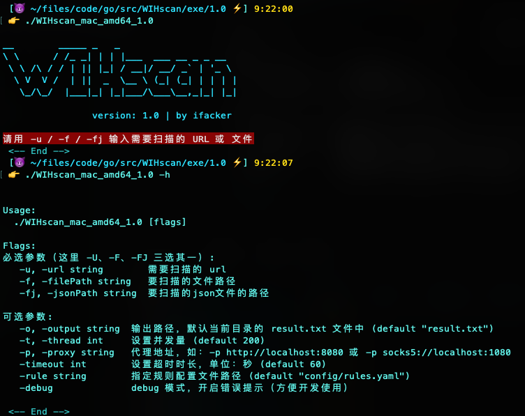

# WIHscan 介绍

## 免责声明：
本网络安全工具仅用于提供技术支持，不涉及任何应用或商业行为。用户在使用本网络安全工具的过程中，不得以任何方式损害他人的合法权益。

该工具的运行仅依赖用户提供的信息，并不包括任何违反相关法律法规的内容。用户在使用本网络安全工具时，必须确保其提供的信息合法、有效、真实可靠，否则可能会产生不利后果。

本软件提供的服务仅供参考，不构成任何责任。用户在使用本网络安全工具时，应自行承担有关安全风险。我们并不对使用者使用本工具所涉及的任何技术服务承担任何义务或责任，无论此类技术服务是否有任何损失和/或损害。  

## 简介：
WIHscan 主要扫描网站 js 是否存在敏感信息，包括一些 AK/SK 之类的，大家可以去 config/ 中自定义规则，从而匹配出自己想要的结果（需要会点正则表达式）  

🎉🎉🎉！
## 使用方法：
```shell
./WIHscan -u http://www.xxx.com/xxx.js
./WIHscan -f jsfile.txt
./WIHscan -fj ARLxxx.json
```

## 操作界面


## 版本信息：
### v1.0 🐶  
1. 支持批量扫描，包括 .js 路径的txt文件，还有灯塔的 json 串，当然，也支持单独的 js
